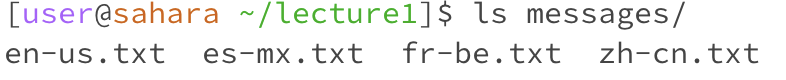
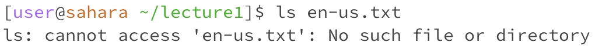
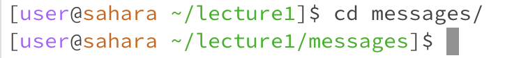
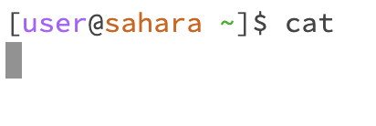
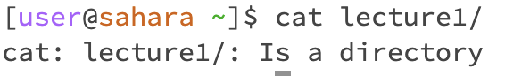

# __Lab Report 1__

## __ls__
  
_When using ls without an argument: The output would result in listing the directories and or files within that directory._  
  
_When using ls with a path to directory: The output would result in listing the directories and or files within that directory._  
  
_When using ls with a path to file: The output would result in an error because ls can not access the contents of a file._  

## __cd__
  
_When using cd without an argument: The output would result in taking the user back to the home directory._  
  
_When using cd with a path to directory: The output would result in taking the user inside the stated directory if it exists._  
  
_When using cd with a path to file: The output would result in an error because cd can not access due to it not being a directory._  

## __cat__
  
__When using cat without an argument: The output would result into taking you out of the terminal._  
  
_When using cat with a path to directory: The output would result into an error because cat can not display directories._  
  
_When using ls with a path to file: The output would result into printing out the content of the file._  

