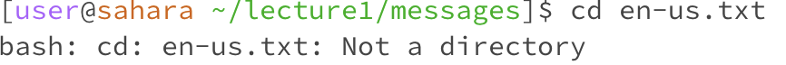

# __Lab Report 1__

## __ls__
  
_explaination_  
  
_explaination_  
  
_explaination_  

## __cd__
  
_explaination_  
  
_explaination_  
  
_explaination_  

## __cat__
  
_explaination_  
  
_explaination_  
  
_explaination_  

